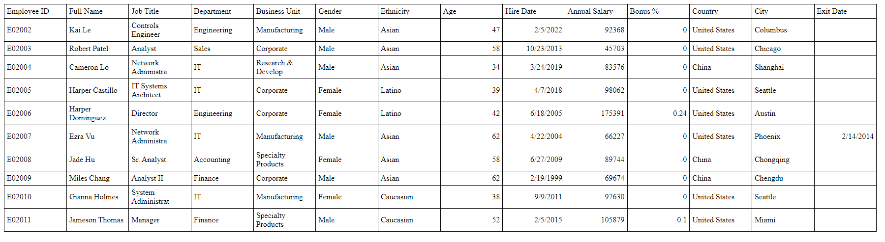

# Workshop: Convertir un fichier Excel en HTML

Ce Workshop porte sur la conversion de fichiers Excel en fichiers HTML. Vous pouvez télécharger le fichier Excel à partir [d'ici](https://github.com/ayoub-kplr/web-api-md/raw/main/01_html_css/Workshops/employee_dataset.xlsx). La conversion en HTML permet de rendre les données plus accessibles et lisibles sur différentes plates-formes, notamment sur le Web. Le fichier HTML ainsi créé peut être facilement partagé et visualisé sur n'importe quel navigateur. Pour vous donner une idée de ce à quoi ressemble le fichier HTML converti, voici un exemple que vous pouvez consulter.

